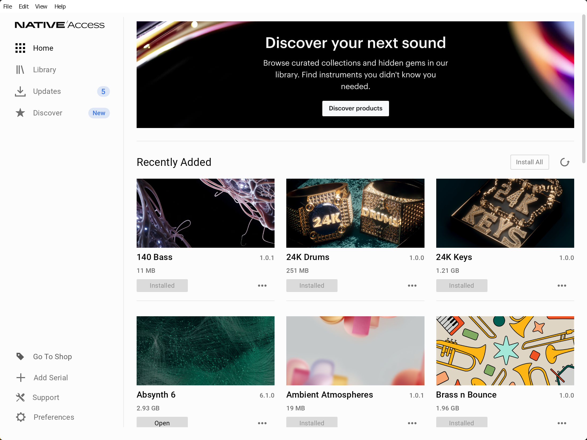

# Native Access & Kontakt 8 on Linux

Run [Native Access](https://www.native-instruments.com/en/specials/native-access-2/)
and Native Instruments products under Wine on Linux. Includes a CLI-based install for Kontakt 8, whose official installer doesn't work under Wine.



- **One-command setup**: dedicated Wine prefix (`~/.wine-ni`), automaticly tweaks Wine and applies experimental patches to fix most issues.
- **Kontakt 8 without the broken installer**: extracts the payload from the
  official installer by manually replaying its MSI file tables, and it fetches the
  authenticated download URL for you.

**This repository does NOT contain, grant access to, or distribute any software from Native Instruments in any way.** It only provides scripts and instructions for installing software you have legitimately obtained from Native Instruments and you need your own account to download and use Plugins and Instruments.

## Install

Runtime dependencies (the CLI itself is pure Python ≥ 3.11 with no pip packages):

| dependency | required | purpose |
|---|---|---|
| wine (staging recommended, WoW64 fine) | yes | runs everything |
| winetricks | yes | vcrun2022 + PowerShell during setup |
| cabextract | yes | msvcp140 fix |
| 7z (`7zip` package; binary `7z`/`7zz`/`7za`) | yes | Kontakt installer extraction |
| msitools (`msidump`) | yes | Kontakt installer extraction |
| procps (`pgrep`) | yes | process checks |
| Xvfb | no | hides installer windows during setup |
| xdotool | no | auto-dismisses installer dialogs |
| zenity or yad | no | graphical setup progress |
| a Chromium-family browser | no | captures NI download URLs |

### Debian / Ubuntu

```sh
sudo apt install winetricks cabextract 7zip msitools xvfb xdotool zenity procps pipx
# Debian 12's wine (8.0) is too old — use the WineHQ repo (winehq-staging).
# Debian keeps winetricks in "contrib"; enable that component.
pipx install git+https://github.com/<you>/native-instruments
```

### Arch

```sh
# Arch's wine/wine-staging are new-WoW64 builds — no multilib needed.
sudo pacman -S wine-staging winetricks cabextract 7zip msitools xorg-server-xvfb xdotool zenity python-pipx
pipx install git+https://github.com/<you>/native-instruments
```

### NixOS

```sh
nix profile install github:<you>/native-instruments
# or add the flake's packages.x86_64-linux.default to your system config
```

A desktop entry for Native Acess is installed with this package. On first launch, it will set up the Wine prefix and install Native Acess.

## Usage

```
usage: ni [-h] [-V] [--prefix PATH] <command> ...

  setup                 create the Wine prefix and install Native Access
  launch [url]          launch Native Access (runs setup first if needed)
  reinstall             wipe the Wine prefix and set everything up again
  kontakt8 install [url]   install Kontakt 8
  kontakt8 update [url]    update Kontakt 8
  kontakt8 uninstall       remove Kontakt 8 from the prefix
  fix-msvcp140          replace Wine's msvcp140 stubs with the real DLLs
  doctor [--fix]        check dependencies, prefix health, login-URL wiring
```

`native-access` (the desktop launcher) is equivalent to `ni launch`.
Every command supports `--help`.

For `kontakt8 install`/`update` without a URL, a browser window opens on the
NI downloads page; log in and the download link is captured automatically
(the browser uses its own profile under `~/.local/state/ni-wine`, so your
login is remembered for next time).

Environment: `NI_WINE_PREFIX` (prefix location, default `~/.wine-ni`),
`WINE` (wine binary override), `NI_WINE_DEBUG` (keep Wine debug output).

## Offline behavior

Native Access has no offline mode. ni-wine detects the situation and tells you up front instead of
letting the app spin. Installed instruments and plugins keep working
offline.

## Troubleshooting

`ni doctor` diagnoses the common failure modes; `ni doctor --fix` repairs
the repairable ones. Native Access's own logs live at
`~/.wine-ni/drive_c/users/Public/Documents/Native Instruments/Logs/`.
